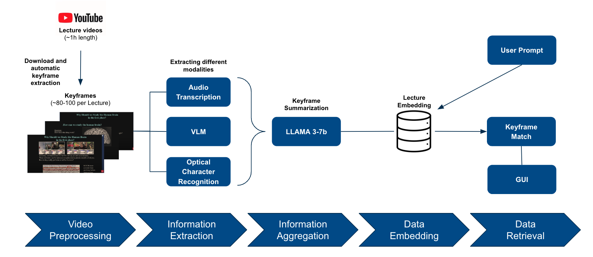

# In-Video Search Using Text Prompts in University Lectures

This project was conducted as part of the Practical Course: Applied Foundation Models in Computer Vision at the Computer Vision group of Professor Daniel Cremers. The focus is on exploring in-video search using text prompts, applied to university lectures which are inherently multi-modal. Searching within long university lectures represents a suitable use case for this technology. We developed a full pipeline with a visual interface.

## Methodology



## Project Overview

We explored a complete pipeline for in-video search using text prompts. The key steps are:

1. **Video Preprocessing**: Downloading and automatically extracting keyframes (~80-100 per lecture) from YouTube lecture videos (~1 hour length).

2. **Information Extraction**: The keyframes are processed to extract different modalities using the following foundational model architectures:

  - [Whisper](https://github.com/openai/whisper) for Audio Transcriptions
  - [LLAVA](https://llava-vl.github.io/) as Visual Language Models (VLM) for image captioning
  - Optical Character Recognition (OCR) library for text extraction

3. **Information Aggregation**: The keyframes are summarized using the [LLAMA 3-7b](https://llama.meta.com/llama3/) model.

4. **Data Embedding**: Embedding lecture content.
5. **Data Retrieval**: Matching keyframes based on user prompts and displaying results in a graphical user interface (GUI).

## Getting Started

### Prerequisites

1. **Install FFmpeg**

   More information on how to install FFmpeg can be found [here](https://ffmpeg.org/download.html).

2. **Install Ollama**

   All models are run locally. Instructions can be found [here](https://github.com/ollama/ollama).

### Installation

```shell
pip install poetry                          // only for the first execution
poetry lock                                 // only for the first execution

.venv\Scripts\activate

poetry config virtualenvs.in-project true   // only for the first execution
poetry install                              // only for the first execution
```

## Running the Pipeline

Make sure you have Ollama running !

Follow the steps in `data_generation_pipeline.ipynb` notebook to download process & embed the videos.

To test the  Search performance:

Run the `retrieve_data.ipynb` notebook for data retrieval.

# Running the Streamlit Frontend

To run the frontend using Streamlit, please follow these steps:

   ```bash
   streamlit run app.py
